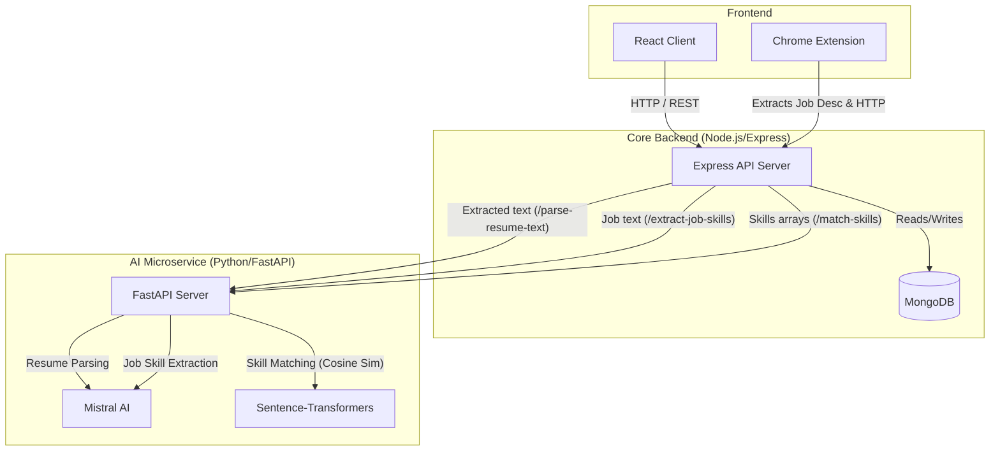

# AI Resume Builder Project Explainer

This document provides a comprehensive, deep-dive analysis of the AI Resume Builder project. It details the architecture, the technology stack, library usages, the role of AI within the application, and limitations/recommendations for future improvements.

---

## 🏗️ 1. Architecture Overview

The system operates as a distributed microservices architecture consisting of 4 main components:
1. **Client (React)**: The user-facing web application.
2. **Chrome Extension**: A browser extension that scrapes LinkedIn job descriptions.
3. **Server (Express Node.js)**: The core API gateway handling authentication, database operations, file extraction, and routing.
4. **AI Microservice (FastAPI Python)**: A dedicated service for heavy LLM and ML computations (parsing, extraction, and embedding matching).

### Architecture Diagram

---

## 📦 2. Tech Stack & Libraries Detailed Breakdown

### Frontend (Client)
- **Framework:** React 18, Vite.
- **Styling:** TailwindCSS, Lucide React (icons).
- **Network:** `axios` (HTTP client talking to Node server).
- **Core Libraries:**
  - `react-dropzone`: Handles drag-and-drop file uploads for resumes (PDF/DOCX).
  - `react-hot-toast`: Provides popup notifications (toast messages).
  - `react-router-dom`: Handles client-side multi-page routing without reloading.

### Browser Extension
- **Platform:** Chrome Manifest V3.
- **Core Usage:** 
  - `activeTab` & `scripting`: Used to inject `content.js` into LinkedIn pages.
  - Automatically reads the DOM to grab the Job Title and Job Description, then sends this payload to the backend via `axios`/`fetch` to analyze against the user's resume.

### Backend (Server)
- **Runtime & Framework:** Node.js 20, Express 5.
- **Database:** MongoDB with `mongoose` as the ODM.
- **Authentication:** `jsonwebtoken` (JWT) for stateless API auth, `bcryptjs` for password hashing.
- **Core Libraries & Their Roles:**
  - **Text Extraction:**
    - `pdf-parse`: Reads binary PDF buffers and extracts raw, unstructured text.
    - `mammoth`: Converts DOCX files to plain text.
  - **File Upload:**
    - `multer`: Middleware for handling `multipart/form-data`. Saves uploaded resumes locally to `/uploads`.
  - **Exporting:**
    - `docxtemplater` + `pizzip`: Takes a `.docx` template and fills it dynamically with the user's JSON data to generate a downloadable DOCX resume.
    - `puppeteer`: Headless Chrome browser used to render the resume as HTML and print it to a perfectly formatted PDF.
  - **Mailing:** 
    - `nodemailer`: Connects to an SMTP server (e.g., Gmail) to email the exported resumes directly to the user.
  - **Error Handling:** 
    - `express-async-errors`: Automatically catches Promise rejections in async route handlers and passes them to the global Express error middleware.

### AI Microservice (Python)
- **Runtime & Framework:** Python 3.11+, FastAPI (served via `uvicorn`).
- **Core Libraries & Their Roles:**
  - **LLMs:**
    - `mistralai`: Official client for Mistral. Used to parse raw unstructured text into structured JSON AND to extract hard and soft skills from job descriptions.
  - **Embeddings / ML:**
    - `sentence-transformers`: Uses the `all-MiniLM-L6-v2` local model to convert text strings (skills) into numerical vectors.
    - `scikit-learn` + `numpy`: Calculates "Cosine Similarity" between skill vectors to determine how closely a resume skill matches a job skill.
  - **Data Validation:** 
    - `pydantic`: Enforces strict data structures for incoming JSON requests (e.g., `SkillsRequest`).

---

## 🤖 3. What the AI Does

The AI layer in this application acts as the "brain," transforming unstructured data into actionable insights through three specific endpoints:

1. **Resume Parsing (`/parse-resume-text`)**:
    - **How it works:** The Node.js server extracts raw text from a PDF/DOCX. It sends this to the Python service. The Python service invokes Mistral AI (`mistral-large-latest`) with a prompt to strictly format the unstructured text into a deterministic JSON object.

2. **Job Skill Extraction (`/extract-job-skills`)**:
    - **How it works:** The Chrome Extension sends a LinkedIn job description to Node, which forwards it to Python. Mistral AI reads the description and extracts a flat array of required skills (e.g., `["React", "Node.js", "Agile"]`).

3. **Semantic Skill Matching & ATS Scoring (`/match-skills`)**:
   - **How it works:** Traditional keyword matching fails when a resume says "React.js" but the job asks for "React". 
   - The AI uses `sentence-transformers` to map both the resume skills and the extracted job skills into a 384-dimensional vector space.
   - It computes the cosine similarity. If the similarity passes a certain threshold (e.g., 80%), it is considered a "Match". 

---

## 🚧 4. Limitations

1. **Synchronous AI Bottlenecks**: The Express server halts and waits for the Python AI service to finish processing (with an Axios timeout of 120,000ms / 2 mins). If parsing takes 15 seconds, the HTTP request hangs for 15 seconds. If traffic scales up, this will tie up the Node event loop and quickly exhaust server resources.
2. **Text Extraction Vulnerabilities**: `pdf-parse` extracts text sequentially. If a user uploads a resume with complex layouts (e.g., 2-column designs, tables, or infographics), the extracted text might be violently jumbled, leading to poor 'hallucinated' parsing by Mistral.
3. **Context Windows and Embedding Limits**: The model `all-MiniLM-L6-v2` has a max token limit. If a resume has an unusually large list of skills, or if a job description is massively long, the embeddings might truncate vital information.
4. **Single Point of Failure**: If the Mistral API goes offline, users lose both resume parsing and skill matching capabilities.
5. **No Visual PDF feedback**: Users can't see precisely what the system "thinks" their resume looks like visually; they only get raw JSON back.

## 🚀 5. Improvements to Make

1. **Asynchronous Task Queues (Message Broker)**: 
   - **Improvement**: Implement Redis and BullMQ (or Celery in Python). When a user uploads a resume, Node returns a `jobId` immediately. The frontend polls or uses WebSockets to get updates while Python processes the AI calls in the background.
2. **Vision-based PDF Parsing**:
   - **Improvement**: Instead of relying on `pdf-parse` text extraction, use a multimodal model (like Gemini 1.5 Pro or GPT-4o). Send the literal PDF file/images to the vision model so it can visually comprehend two-column layouts and tables, yielding vastly superior parsing accuracy.
3. **LLM Performance & Speed (Groq/Gemini)**:
   - **Improvement**: Re-implement Groq (LLaMA 3) or Gemini 1.5 Flash for faster skill extraction inference.
4. **Caching Embeddings**:
   - **Improvement**: Common skills ("JavaScript", "Python") should have their embedding vectors cached in a database or Redis. This avoids passing the text to `sentence-transformers` every single time, drastically speeding up the matching process.
5. **Cloud File Storage**:
   - **Improvement**: Currently, files are stored on the local `/uploads` disk. If the server scales horizontally, local disk storage will fail. Implement AWS S3 or Cloudinary to store PDFs and DOCX files.
